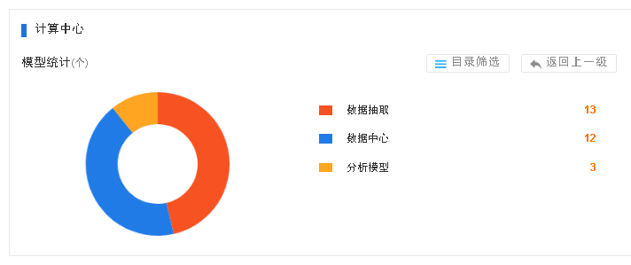

【问题描述】

大数据中心Portal模型统计默认读取的目录不对，导致页面默认展示的模型数据为0，应该显示“我的模型”中的数据。
。
【解决方法】

> 1.	查询dw_catalog表，查当前登录账户的name值为数据管理员@radomain.gov
> 2.	查r_directory表，查目录结构directory_name的值为“数据管理员的模型”
> 3.	将r_directory表中directory_name的值改为数据管理员@radomain.gov，与dw_catalog中的值一致；
> 4.	修改完成后，大数据中心首页模型统计默认可显示为“我的模型”下的数据：

