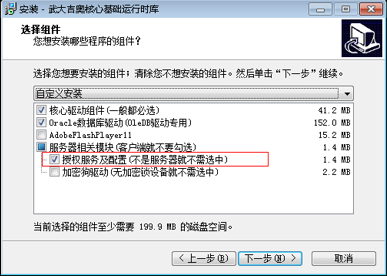
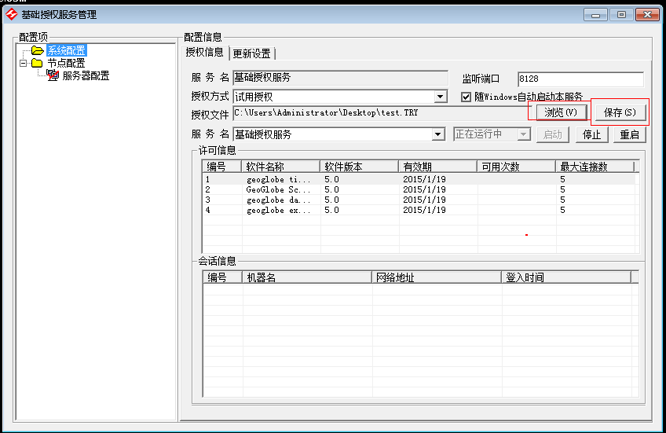

问题描述：

如何进行Desktop网络授权？

问题解答：

1.	拿到“授权客户端组件”（如果没有可以联系吉奥），以管理员身份运行regsvr32注册XCore.dll和XPublic.dll；

2.	打开XSerial.exe获取机器码发给武大吉奥获取授权文件；

3.	在服务器上安装“吉奥基础驱动与授权安装(通用).exe”，安装过程中需要勾选服务器相关模块（见下图）；

4.	浏览本地授权文件，然后保存；打开开始菜单下Desktop许可管理器，在网络授权里面添加网络授权（格式8128@ip）

