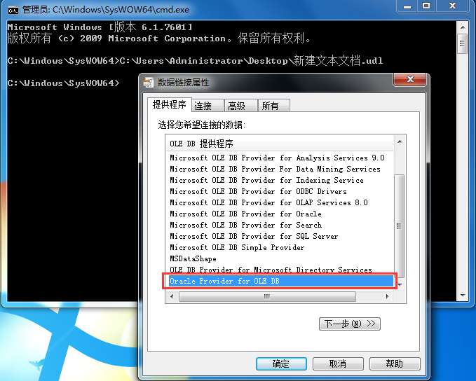

### 问题描述： ###

GeoGlobeDesktop连接oracle失败。

### 解决方法： ###
1)检查本机是否按照了oracle客户端（GeoGlobeDesktop为32位程序，需要安装32位的客户端），并安装的是管理员模式；  
2)检查Oracle客户端的Net Manager是否能连上数据库 ； 
3)如果Oracle客户端是10g，需将Desktop安装在不带括号的路径，如默认安装路径是"C:\Program Files (x86)\GeoGlobe"，可以改为"C:\Program Files\GeoGlobe" ；  
4)检查Oracle的ODBC驱动是否安装；  
检查方法：正常新建一个txt文件，将后缀名改成udl，32位操作系统直接打开cmd命令（如果是64位操作系统，打开C:\Windows\SysWOW64下的cmd.exe），然后将udl文件拖入cmd窗口回车，检查是否包含Oracle驱动

5)重新连接数据库。   

  
