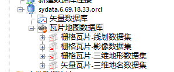

### 问题描述： ###

GeoGlobeDesktop连接初始化后oracle数据库，矢量数据库可以用，瓦片数据库不能用。   

### 解决方法： ###
  
不能使用的原因是：选择初始化的用户不是system用户。正确的初始化流程为：  
1)创建orcl的实例  
2)用system用户初始化库  
3)新建一个用户  
4)采用3)中新建的用户在Desktop或TileManager中连接。

