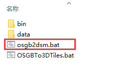
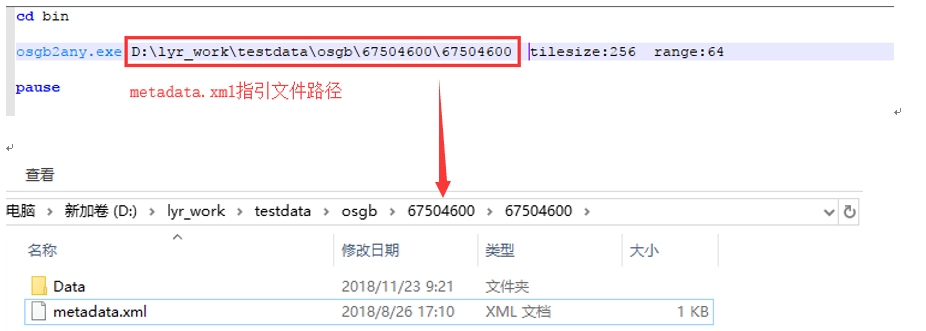
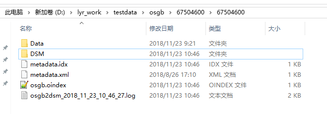
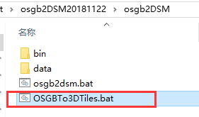
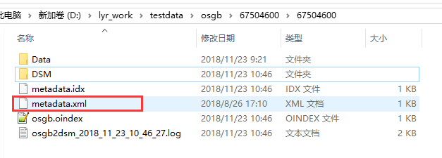
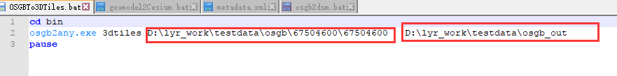
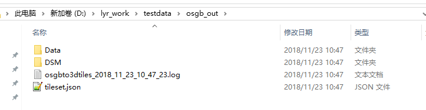

问题描述：

怎样将OSGB倾斜数据转换到3dtiles格式的数据

解决方法：

使用osgb2DSM转换工具将原始的倾斜.osgb数据转换成3dtiles格式：
osgb2DSM工具使用流程如下：

一、抽取DSM

1、打开osgb2DSM工具文件夹，用文本打开osgb2dsm.bat，如图一。

2、编辑运行文件，修改运行文件的输入路径，为metadata.xml所在的路径，保存修改，如图二。

3、双击运行osgb2dsm.bat文件，生成DSM到同级目录下，生成结果如图三。生成结果中多了metadata.idx、osgb.oindex、DSM文件夹及转换的日志.Log文件。

二、OSGB转3DTiles
1、	用文本打开OSGBTo3DTiles.bat文件，修改OSGBTo3DTiles.bat文件中的数据的输入与输出路径，输入路径为metadata.xml文件所在的目录，输出为自建目录（不支持中文路径）。

2、	编辑完bat文件后保存，双击运行此转换工具，转换成果用于web端服加载。
转换成果如下：

