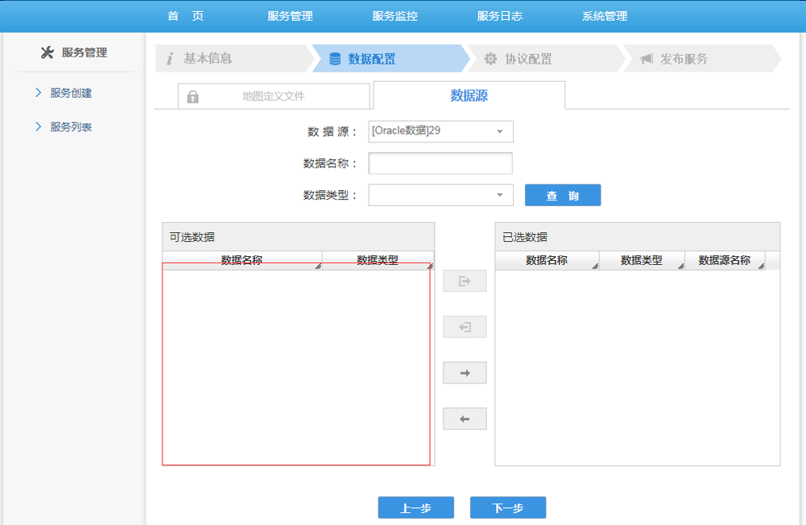

### 问题描述： ###

GeoGlobeServer发布服务选择数据源时，未加载出数据。   
     

### 解决方法： ###
1)检查该数据源是否有对应该服务的数据；   
2)检查检查环境变量是否设置（JAVA_HOME，GEOGLOBESERVER_HOME，LD_LIBRARY_PATH）；   
3)检查内核文件是否齐全（用depend工具查看其依赖关系是否正确）；  
4)检查JDK扩展包是否齐全(可以主要看gskernel.jar和ggserver-spatialreference.jar)。

    