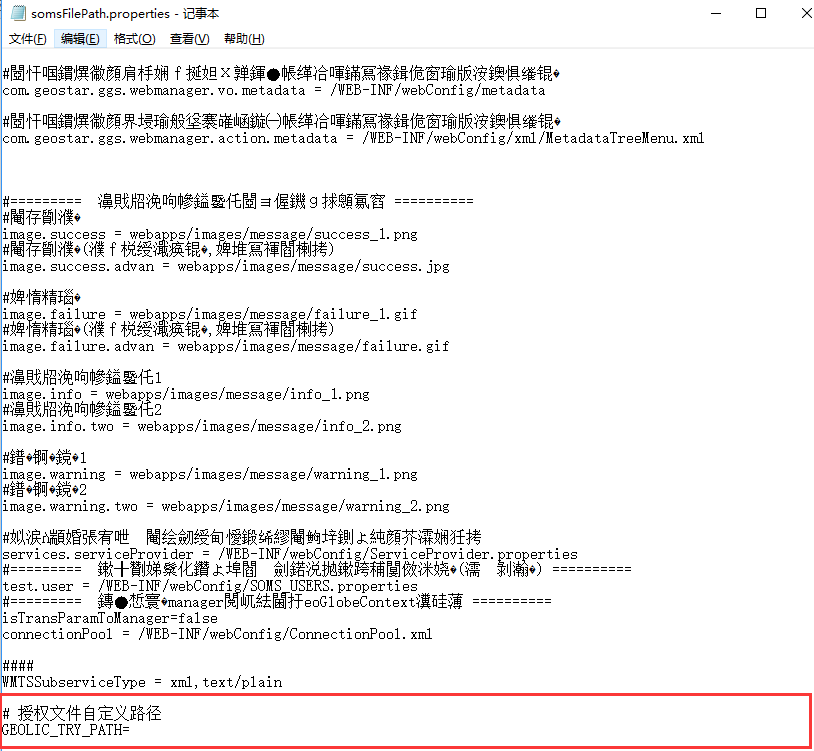

问题描述

7.0的GeoGlobe Server授权文件如何使用？

解决办法：

1.	将授权文件放到*:\Program Files\GeoStar\GeoGlobe\Server7\support\ext-resource\data\geolic的路径下，即可授权成功。

2.	修改配置文件

打开*:\deploylocation\deploylocal\ServiceMgr\WEB-INF\classes\config路径下的somsFilePath.properties文件，修改
授权文件自定义路径
GEOLIC_TRY_PATH=C:\\Users\\Administrator\\Desktop\\Geo-546BE6.TRY （授权文件路径即可） 

如下图所示：
