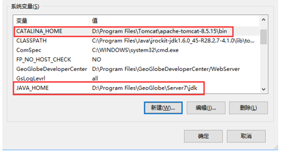
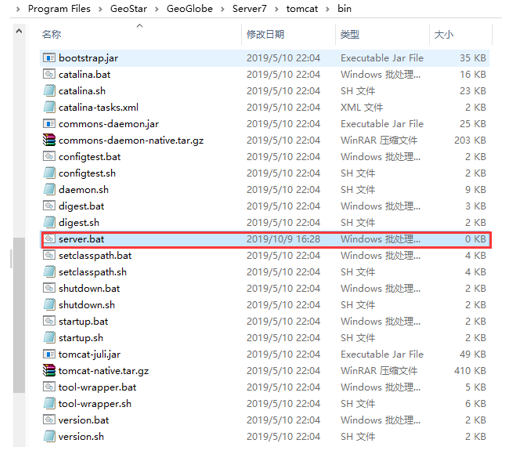
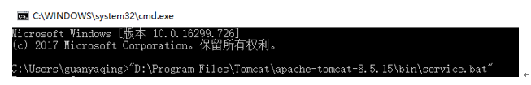
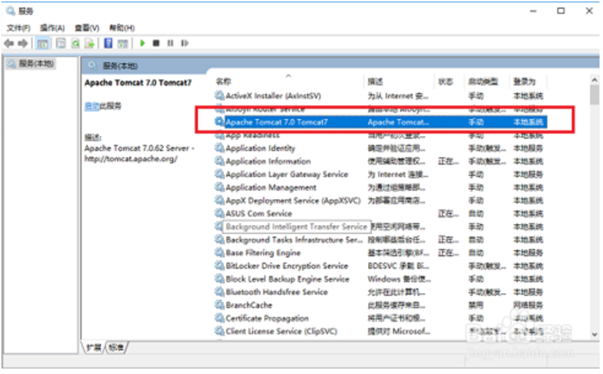
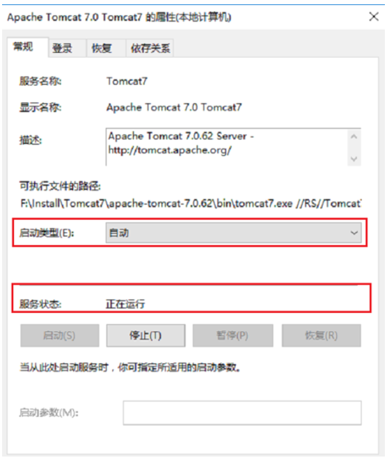

问题描述

Tomcat部署的server如何设置开机自启动？

解决办法：

1.	我们首先需要配置jdk和tomcat的环境变量，
CATALINA_HOME：D:\Program Files\Tomcat\apache-tomcat-8.5.15\bin (tomcat安装路径)
JAVA_HOME：D:\Program Files\GeoGlobe\Server7\jdk (jdk安装路径)
Path: %JAVA_HOME%\bin（jdk安装路径bin目录），如下图所示：

2、	配置jdk和tomcat环境变量之后，进去tomcat安装路径的bin目录，找到service.bat，如下图所示：

3、	按win+R键打开运行，输入cmd，进去命令提示符之后，将service.bat拖放到命令提示符中，按回车键进行注册tomcat服务，如下图所示：

4、	成功注册tomcat服务之后，按win+R键打开运行，输入services.msc，点击确定进去系统服务界面，找到“Apache Tomcat”服务，如下图所示：

5、双击tomcat服务进去，设置启动类型为自动，并进行启动服务，如下图所示：
