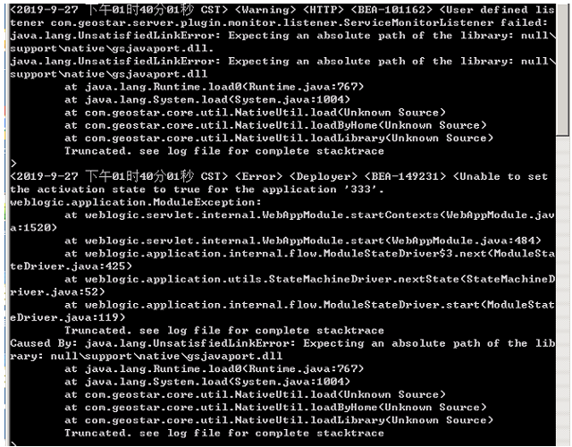

问题描述：

Weblogic集群子节点启动报错，如下图：

解决办法：

1.	修改启动脚本增加内存、jdk路径、加环境变量
	
2.	改setDomainEnv：内存、jdk路径、加环境变量
set GEOGLOBESERVER_HOME=C:\Program Files\GeoGlobe\Server6

set JAVA_VENDOR=Sun

set JAVA_HOME=C:\Program Files\GeoGlobe\Server6\jdk

set PATH=%PATH%;C:\Program Files\GeoGlobe\Server6\support\native
