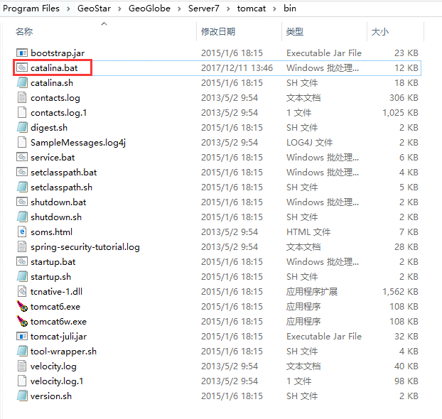
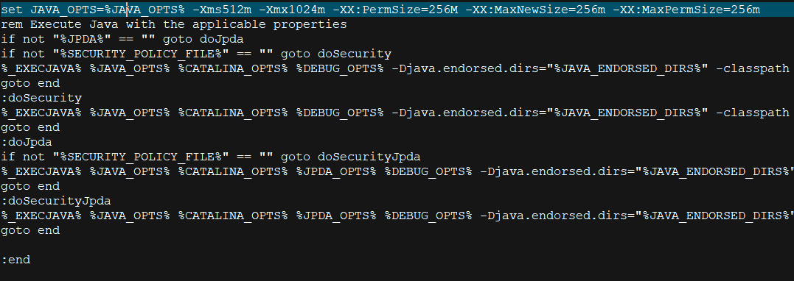

问题描述：

如何修改tomcat的内存？

问题解决：

1.找到tomcat在本地电脑中的安装目录，进入这个目录，然后进入bin目录中，在window环境下找到bin目录中的catalina.bat，在linux环境下找到catalina.sh如下图所示：

2.右键编辑catalina.bat这个文件，找到set JAVA_OPTS这个选项的位置，这个参数是java启动的时候，需要的启动参数。将这个参数设置为set JAVA_OPTS ='-Xms512m -Xmx1024m'表示初始化分配内存为512MB，可以使用的最大内存为1024MB。

