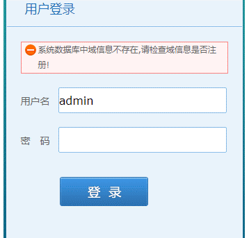

### 问题描述： ###

GeoGlobeServer登录运维时提示“系统数据库中域信息不存在，请检查域信息是否注册”。   
     

### 解决方法： ###
1)检查本机IP是否变化；   

2)检查配置文件和运维数据库信息是否一致；   
①查看配置文件信息:   
  \deploylocation\deploylocal\ServiceMgr\WEB-INF\webConfig\ConnectionPool.xml文件中的配置的信息  
 ` ConnectionPool name="IP:9010:tomcat" anotherName="domain1" `   
配置的运维数据库：
 `  <URL>jdbc:sqlite:C:\Program Files\GeoGlobe\Server\support\dbscript\sqlite\GeoGlobe.db</URL>`  

②查看运维数据库配置信息：  
 `  <URL>jdbc:sqlite:C:\Program Files\GeoGlobe\Server\support\dbscript\sqlite\GeoGlobe.db</URL>`
找到`GGS_SR_APPSERVER`表，查看该表中IP、端口等信息是否与①中配置的一样  

3）将不一致的信息进行修改，重启GeoGlobeServer。  

    