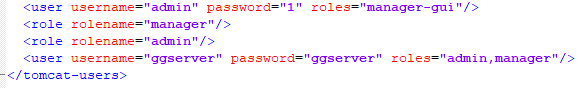

问题描述：

Tomcat部署的GeoGlobe Server如何新加一个用户？

问题解答：

找到tomcat的安装路径，以自带路径为例*ProgramFiles\GeoStar\GeoGlobe\Server7\tomcat\conf，找到tomcat-users.xml这个文件，打开新增加<user username="ggserver" password="ggserver" roles="admin,manager"/>。

如下图：

