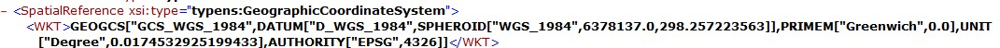
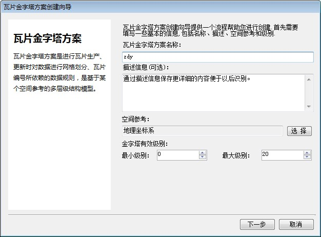

问题描述：

ArcGIS生产的缓存数据文件（空间参考WGS84），现在想将该数据转换成GeoGlobe格式的缓存数据，直接通过GeoGlobe进行数据导入时，程序提示金字塔方案不对应，不能进行导入。

解决方法：

1.	首先，查看ArcGIS缓存文件的配置信息，见缓存文件中的Conf.xml，从该文件中我们能够获取以下信息：

1)	空间参考信息，该数据的空间参考为WGS84，如图所示：

2)	金字塔起始层级和每一层级的分辨率，如图所示：

3)	数据原点坐标，如图所示:

4)	缓存数据的瓦片像素，如图所示：

2.	在金字塔创建向导中创建金字塔，设置空间参考和级别，通过上步骤的工作我们得知参数分别是WGS84和0-20级，如图所示：

3.	填写瓦片原点坐标和瓦片像素，如图所示：

高斯金字塔瓦片递增方向也设置从左上方向开始。

4.	填写每一层瓦片对应的分辨率信息，如图所示：

5.	按照默认向导完成金字塔方案创建。