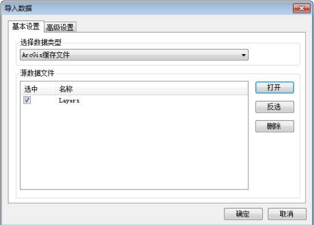

### 问题描述： ###
如何根据ArcGIS缓存文件瓦片生产GeoGlobe瓦片。

### 解决方法： ###
1)创建对应的金字塔方案,参见：[金字塔_如何根据ArcGIS的金字塔方案创建GeoGlobe的金字塔方案](https://github.com/GeoStar2018/GeoStarFAQ/blob/master/GeoGlobe/TileManager/%E7%93%A6%E7%89%87%E7%94%9F%E4%BA%A7/%E9%87%91%E5%AD%97%E5%A1%94_%E5%A6%82%E4%BD%95%E6%A0%B9%E6%8D%AEArcGIS%E7%9A%84%E9%87%91%E5%AD%97%E5%A1%94%E6%96%B9%E6%A1%88%E5%88%9B%E5%BB%BAGeoGlobe%E7%9A%84%E9%87%91%E5%AD%97%E5%A1%94%E6%96%B9%E6%A1%88.md)；

2)使用TileManager创建瓦片数据集，并选择1)创建的金字塔方案；    

3)【导入数据】-选择数据类型为“ArcGis”缓存文件；  
  
4)点击确认，等待数据导入完成。