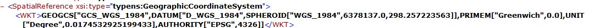
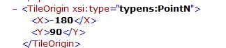
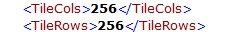
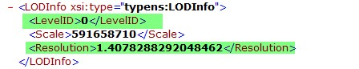
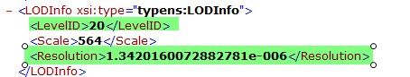
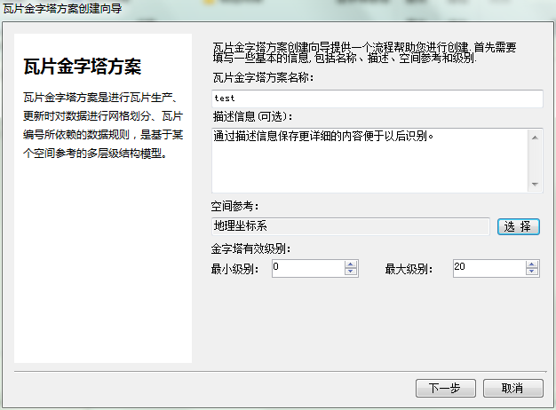
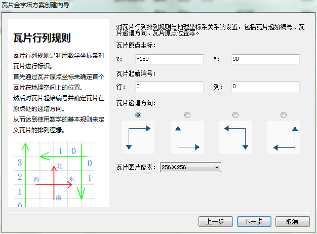
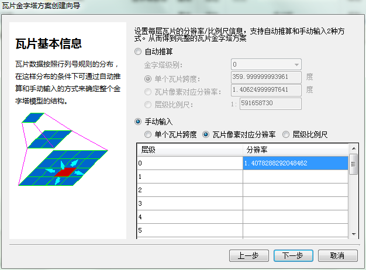

### 问题描述： ###
如何根据ArcGIS的金字塔方案创建GeoGlobe的金字塔方案。

### 解决方法： ###
1)找到ArcGIS的金字塔方案信息文件：Conf.xml；

1.①从Conf.xml文件获得空间参考信息（下图空间参考为：wgs84） 
    

1.②从Conf.xml文件瓦片的起始原点(下图起始原点为：（-180，90）)  
 

1.③从Conf.xml文件瓦片的像素大小 (下图像素大小为：256*256)   

1.④从Conf.xml文件获得瓦片的起始层级、结束层级、每一级对应的分辨率（下图中，起始层级为0，结束层级为20，以及对应的分辨率，中间截图省略）  
  
   
 
2)使用GeoGloe创建对应金字塔方案  
2.①输入金字塔方案名称、描述信息、空间参考（1.①获取）、瓦片有效级别（1.④获取）
  
2.② 输入瓦片原点坐标（1.②获取）、瓦片递增方向、瓦片图片像素（1.③获取）   
  
2.③ 手动输入没级瓦片像素对应分辨率（1.④获取）  
