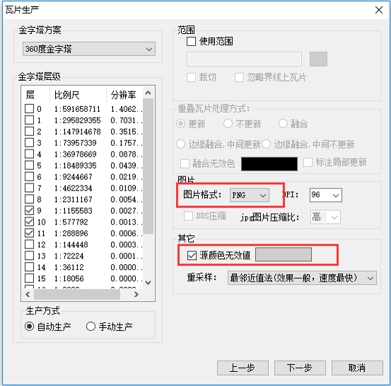
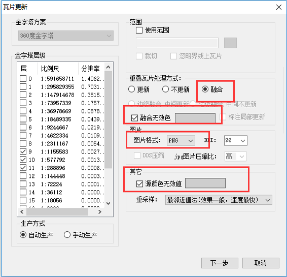

### 问题描述： ###

GeoGlobeTileManager生产栅格瓦片-影像数据集，需要去除黑边。

### 解决方法： ###
1)使用第三方工具（如wondows自带的画图工具、QQ截图工具等）获取原始影像黑边的具体RGB值； 

2)在瓦片生产参数设置时，设置“图片格式”：“PNG”、设置“源颜色无效值”（步骤1方式获取的） 
  

3)若存在多幅重叠影像需生产且无效色不一致，可以在生产完成一幅后，用边界融合的方式将第二张影像更新到目标数据集中；设置“重叠瓦片处理方式”：“融合”、设置设置“图片格式”：“PNG”、设置“源颜色无效值”（步骤1方式获取的）  
  

注：“JPG”格式无透明通道，若仅设置无效色，也无法透掉该颜色。
  
