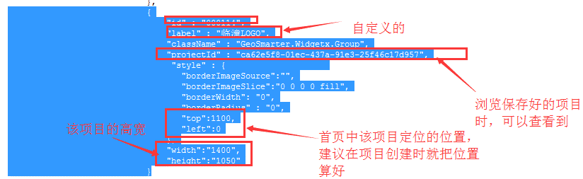

问题描述：

GeoShow行业模板方式实现

问题解答：

首页目录树如何增加、修改修改C:\Program Files\GeoSmarter2017\server\webapps\GeoShow\web\workbench\theme\smartCity\js\ToolbarCfg.js每次目录树上需要新加项目时，在对应的目录下复制新加一个项目修改配置文件，示例如下，ID递增即可。小知识：前期如果不需要定位准确只为实现效果，可以通过拖动来定位位置，项目的填充不要为1，建议”_factor”:0.8，不然不好拖动。

