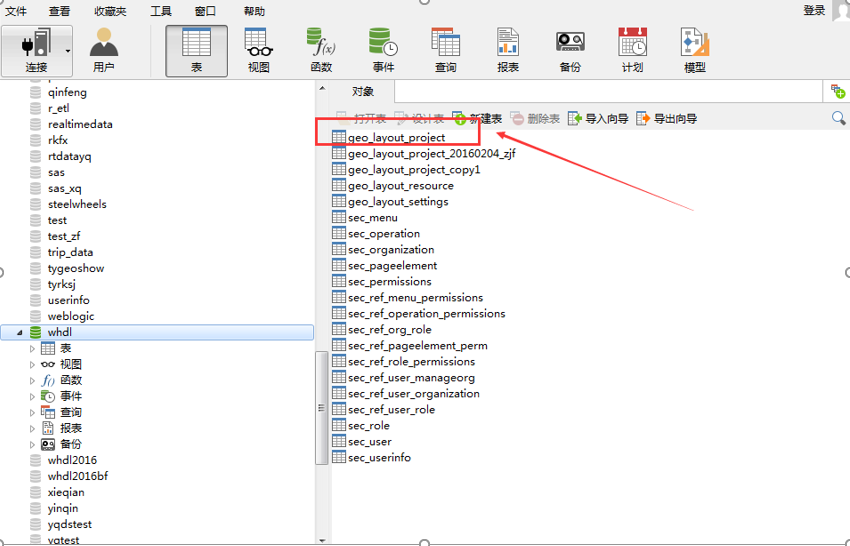
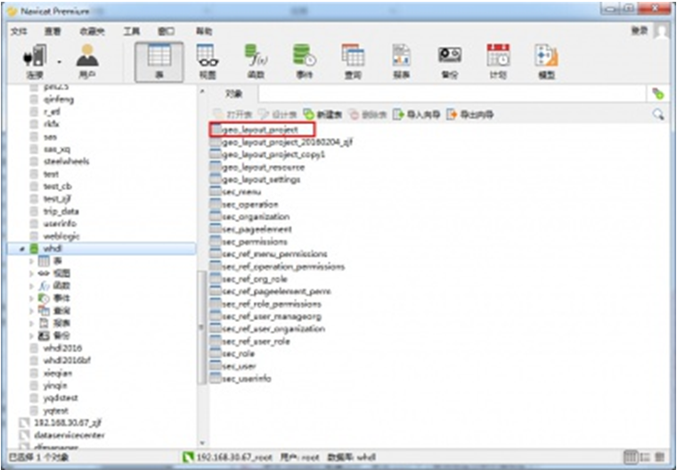
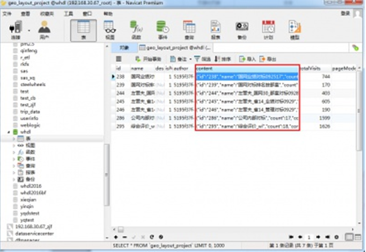
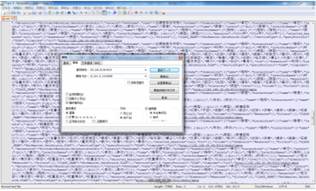

问题描述：

GeoShow项目如何迁移?

问题解答：

请严格按照一下几点进行GeoShow迁移:
1) 将原环境中的GeoShow数据库的表geo_layout_project复制到新环境的数据库中（GeoShow配置的项目信息都在geo_layout_project表中），如图所示：

2) 编辑表geo_layout_project，修改content字段服务地址；
 A. 打开表geo_layout_project，如图所示：

B. 编辑每行数据的content列，将其中的服务地址替换为新环境中的服务地址，如图所示：

