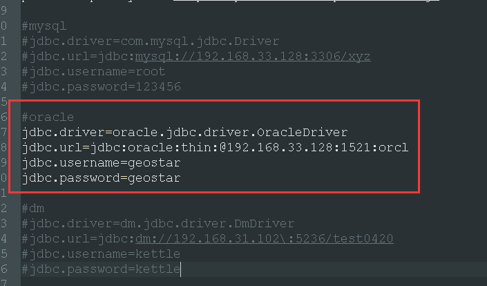
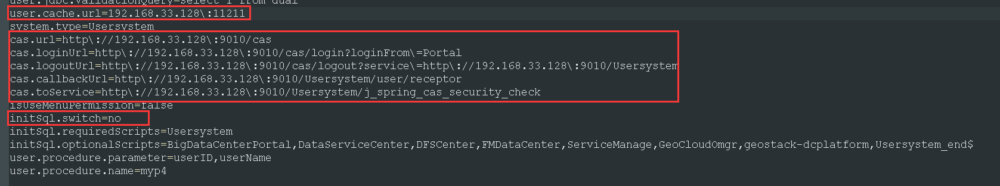
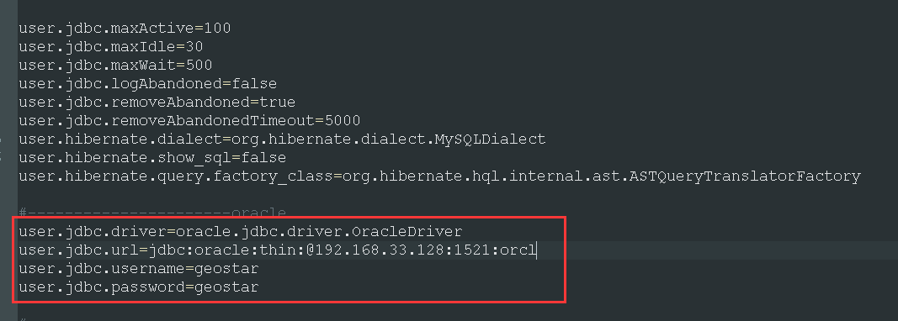
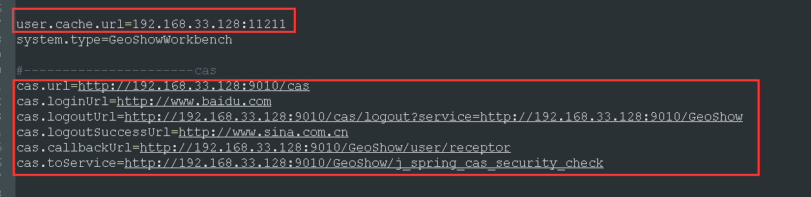
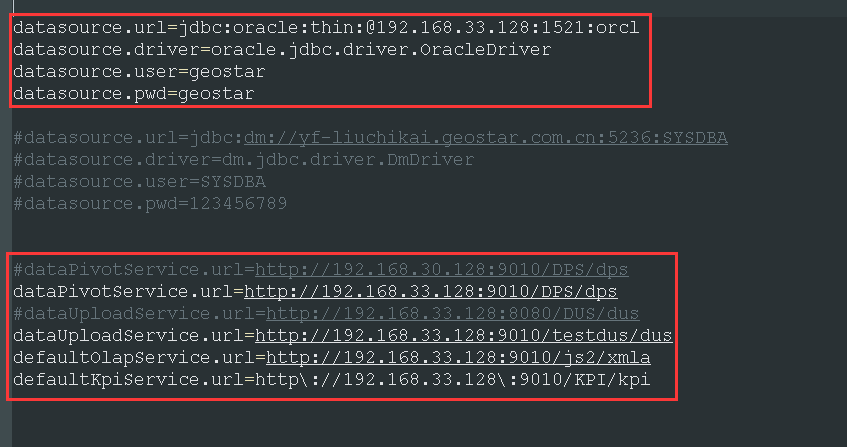

### 问题描述： ###
GeoShow如何安装部署（在GeoSmarter第五版基线以上）。

### 解决方法： ###
1)安装运行环境（runtime）,已安装则忽略；

2)运行GeoShow安装包，按照默认设置完成安装；    

3)修改CAS配置文件  
  打开\server\webapps\cas\WEB-INF\cas.properties，填写运维库的数据库信息。（已安装GeoSmarter并修改了cas的，则忽略此步）  
  
  
4)修改用户系统配置文件  
 打开\server\webapps\Usersystem\WEB-INF\classes\config\config_user.properties，修改下图标记的缓存服务器地址和cas地址，注意initsql为初始化数据库，需要把no改成yes。（已安装GeoSmarter并修改了的，则忽略此步）  
  

5)修改GeoShow配置文件  
打开\server\webapps\GeoShow\WEB-INF\classes\config.properties，修改运维库信息、缓存服务器地址和cas地址
   
  
   
6)修改运维库的信息  
打开\server\webapps\GeoShow\WEB-INF\classes\config\ jdbc.properties ， 修改几个服务的地址（一般为本机IP）  
  