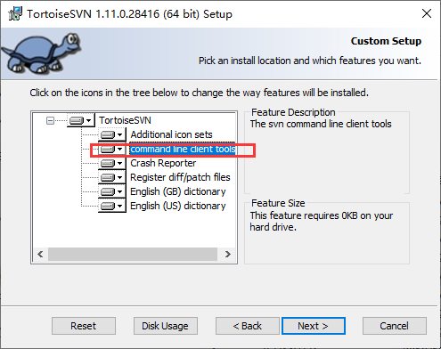

问题描述：

SVN自动更新批处理

问题解答：

碰到很多SVN目录需要重复更新的时候，可以直接使用SVN命令来处理。
首先确保SVN安装中选上“command line client tools”

    @echo off
    svn.exe update %dir1%
    svn.exe update %dir2%
    svn.exe update %dir3%
    pause
    

rem %dir%代表SVN路径