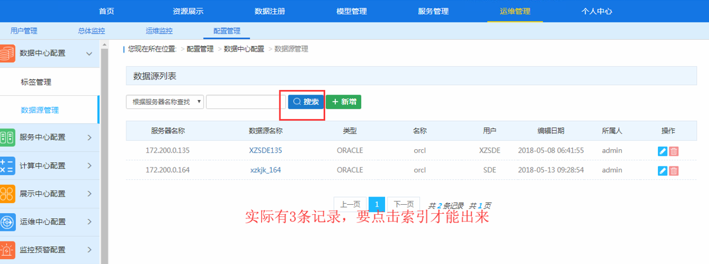
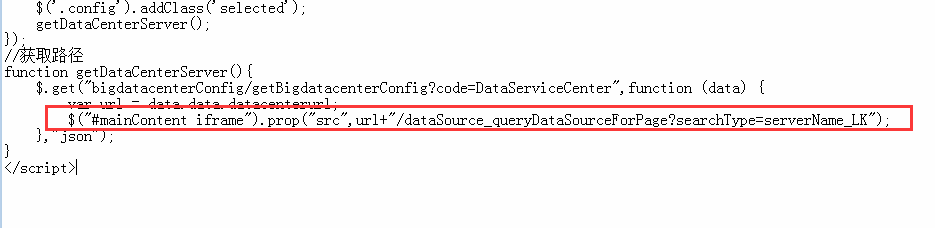

问题描述：

“数据源管理”的标签页中，默认统计记录只有两条，单击“搜索”按钮后，才会统计出全部的记录

问题解决：

此bug基本上好多版本都存在，目前2018第二版
修改FMDataCenter/operationCenter/centerConfig/dataConfig.jsp 
添加$("#mainContent iframe").prop("src",url+"/dataSource_queryDataSourceForPage?searchType=serverName_LK");

