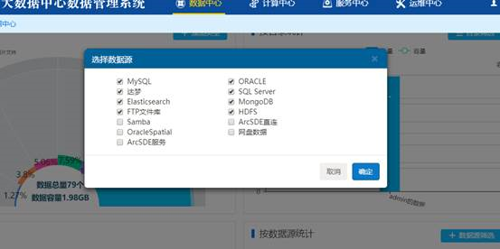
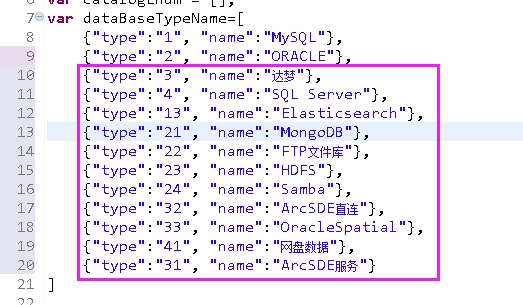
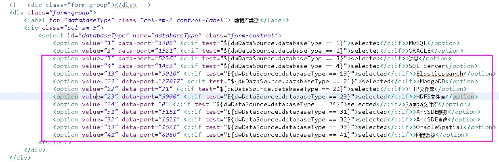

### 问题描述： ###

因项目需要，需求屏蔽不需要注册的的数据源类型。    
   

### 解决方法： ###
2)打开view\dwms\theme\default\js/index.js，将不需要进行统计的数据源类型移除；  
  

2)打开view\dwms\dataSourceRegister.jsp， 将不需要进行注册的数据源类型移除。 
    
 
注意：不提倡、不建议项目人员自行修改此项配置，该方法仅供技术支持人员参考，若有此需求请先与技术支持人员联系处理。

