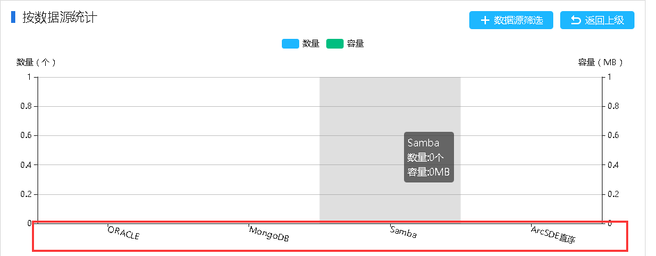
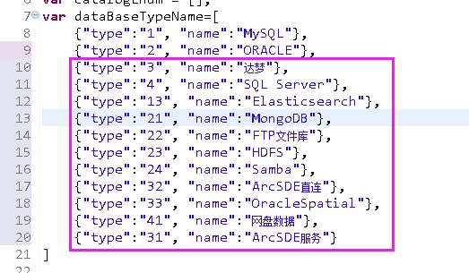

### 问题描述： ###

数据源_如何屏蔽首页不需要统计的数据类型。    
   

### 解决方法： ###
打开\server\webapps\DataServiceCenter\view\dwms\theme\default\js\index.js，将不需要进行统计的数据源类型移除。如下图：   
   

注意：不提倡、不建议项目人员自行修改此项配置，该方法仅供技术支持人员参考，若有此需求请先与技术支持人员联系处理。

