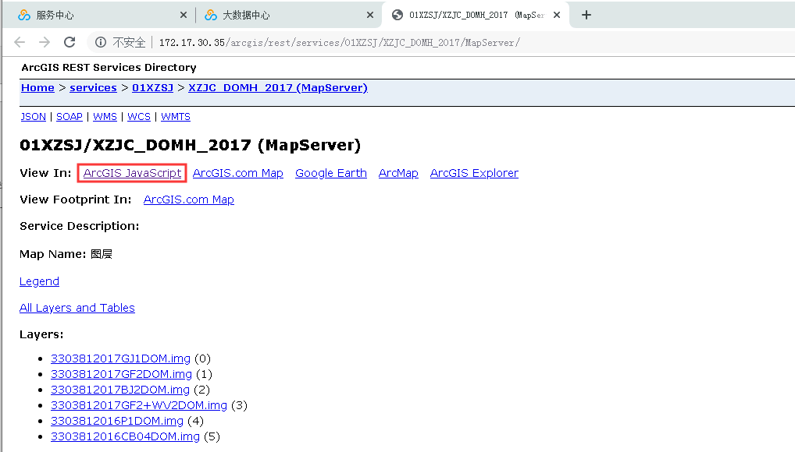
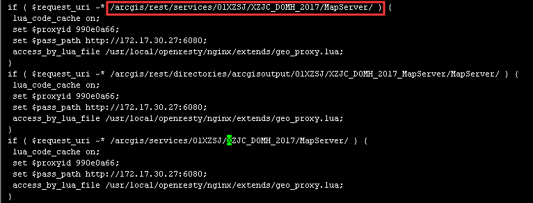
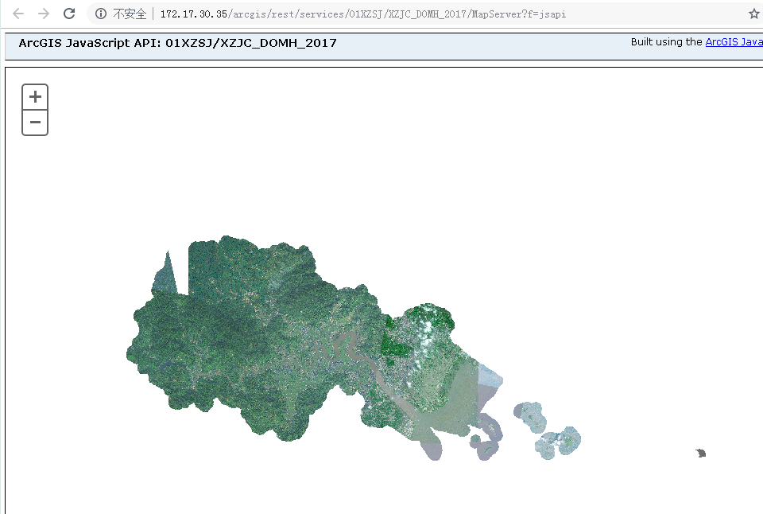

问题描述：

在大数据中心服务中心访问经过NginxProxy代理后的服务地址，选择在ArcGIS JavaScript中预览地图

点击“ArcGIS JavaScript”后报500 Internal Server Error：

问题解答：

- 1.	登录NginxProxy所在虚拟机，进入serviceproxy的docker容器中；
- 2.	进入/usr/local/openresty/nginx/extends目录下，打开lua.conf；
- 3.	根据服务名在lua.conf中查找相应服务的url：

- 4.	去掉request_uri末尾的“/”，保存并退出lua.conf文件。
- 5.	在/usr/local/openresty/nginx/sbin目录下执行./nginx -s reload，重新加载lua.conf配置文件。
- 6.	重新访问经过NginxProxy代理后的服务地址，选择在ArcGIS JavaScript中预览地图，可以正常预览：

