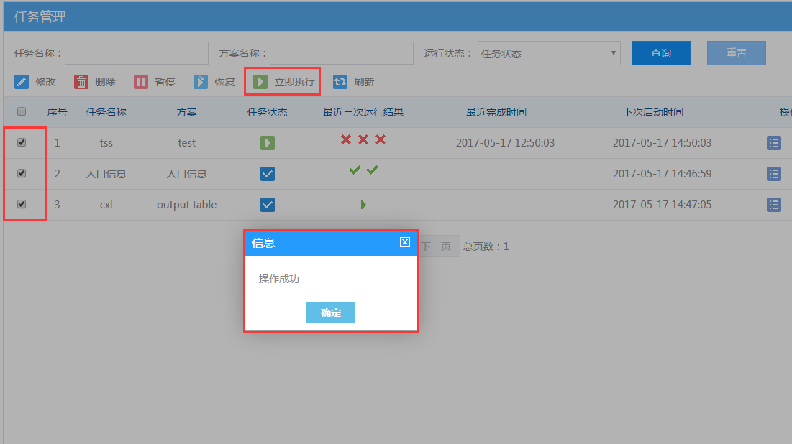

### 问题描述： ###

使用GeoSmarter3.0版本数据融合管理中心任务管理中不能对任务批量操作，删除、暂停、恢复、立即执行等功能。

### 解决方法： ###
GeoSmarter3.0版本数据融合管理中心是不支持任务批量操作的，GeoSmarter2017版本数据融合管理中心已对任务管理功能进行了升级，支持删除、暂停、恢复、立即执行等功能的批量操作。  
  
   
  

