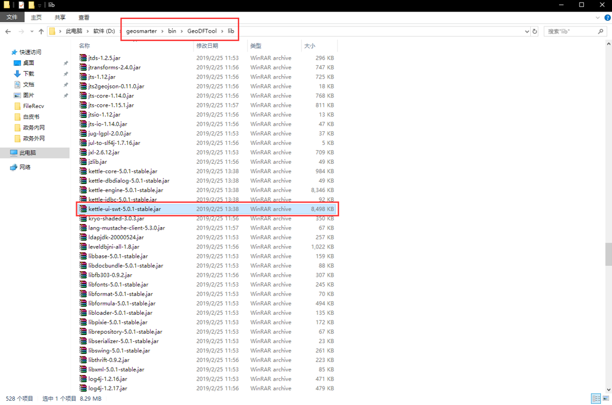
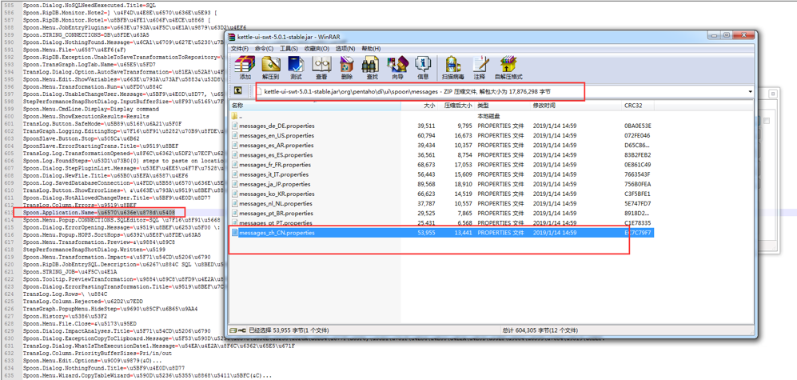
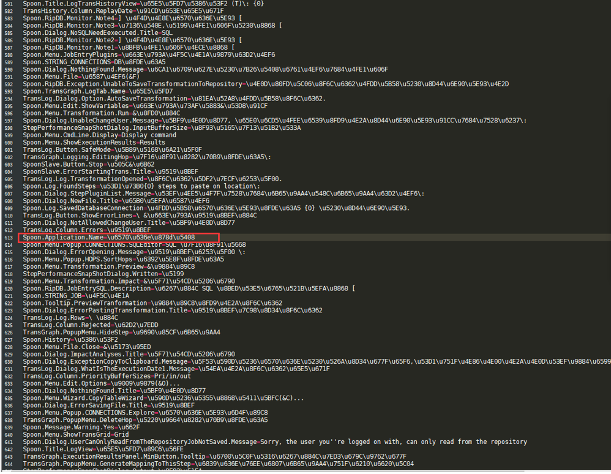

1、备份如下路径（GeoSmarter\bin\GeoDFTool\lib）的kettle-ui-swt-5.0.1-stable.jar（版本号可能有差异）这个jar包。

2、打开kettle-ui-swt-5.0.1-stable.jar，在如下路径（kettle-ui-swt-5.0.1-stable.jar\org\pentaho\di\ui\spoon\messages）找到messages_zh_CN.properties这个文件，拷贝出来修改。

3、修改Spoon.Application.Name属性的值为“数据交换服务系统”的unicode值（即：Spoon.Application.Name=\u6570\u636e\u4ea4\u6362\u670d\u52a1\u7cfb\u7edf）

4、保存messages_zh_CN.properties改动，并把配置文件替换回原来的位置（kettle-ui-swt-5.0.1-stable.jar\org\pentaho\di\ui\spoon\messages）。保存改动即可