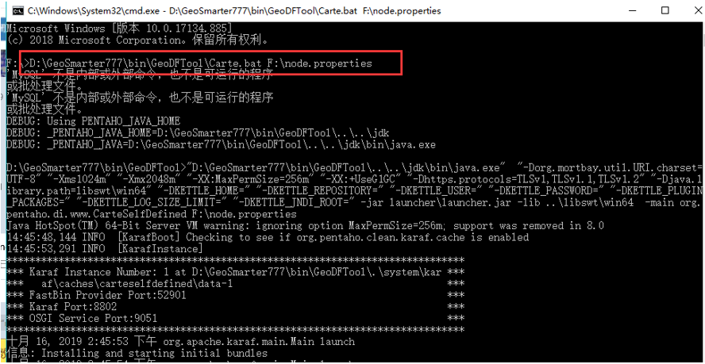

问：计算中心手动启动节点方法。

答：在新版本的大数据中心，已经停止出win版本下的节点包，windows版本则需要手动启动节点，方法如下

1、	新建名为node.properties的文件。

2、	内容为
>      #数据库类型
>     driver=com.mysql.jdbc.Driver
>     #driver=oracle.jdbc.driver.OracleDriver
>     #数据库连接字符串
>     url=jdbc\:mysql\://192.168.36.113:3306/geo
>     #url=jdbc:oracle:thin:@192.168.30.80:1521:orcl
>     #数据库用户名
>     username=geo
>     #数据库密码
>     password=123456
>     #节点名称
>     nodename=节点4
>     #节点的IP
>     nodeIp=192.168.36.113
>     #节点的端口
>     nodePort=9330
>     #节点描述
>     nodeDescription=节点4
>     #节点组ID
>     nodeGroupId=1
>     #性能占比(单位为%)
>     performancePercent=90%
>     #节点上正在运行的任务的最大个数
>     runningMax=1
>     #资源库最大连接数
>     maxConnections=10
>     #资源库最大空闲数
>     maxIdle=2
>     #最大建立连接等待时间
>     maxWait=1000
>     #请求跳转的url
>     httpurl=http://192.168.36.113:9010/DFManager/TaskSchedulingServlet
>     #发送间隔时间（毫秒）
>     sendTime = 5000
>  
>  
   
3、	启动cmd，首先挂载文件在安装目录的/bin/GeoDFTool/Carte.bat 下，以及节点文件

