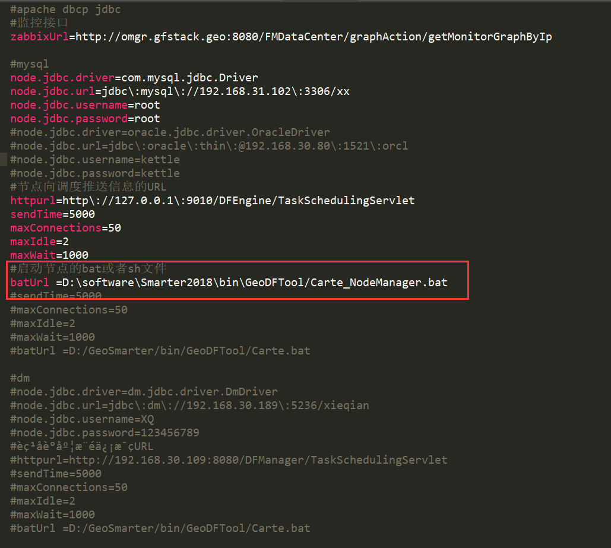

### 问题描述： ###

计算中心如何启动节点。

### 解决方法： ###
1)\GeoSmarter\server\webapps\NodeManagerTool\WEB_INF\classes\config\config.properties修改对应配置文件路径；    
  
  
2)修改完对应配置后，通过页面化的形式新增节点
http://127.0.0.1:9010/NodeManagerTool/nodeController/nodePageList#
 

