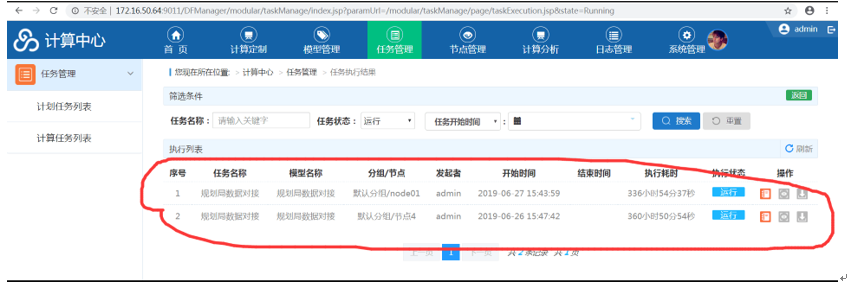

问题描述：

计算中心任务执行结果存在异常

问题解答：

该问题产生的原因是，节点服务器重启，导致节点上的任务终止，无法更改状态日志，导致表一直有一个正在运行的任务，实际上任务已经终止。
模型在节点初始化的结束后，会向日志表中插入一条日志，状态为running，当人任务完成或者任务异常时，节点再将该日志的状态改为完成或异常，如果任务初始化完成，并在任务中。
解决方案：如果再遇上述问题，可操作dfs_execute_log表，将该条running日志删除即可。

