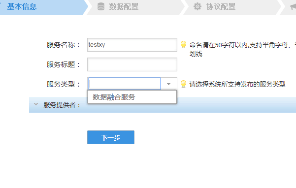
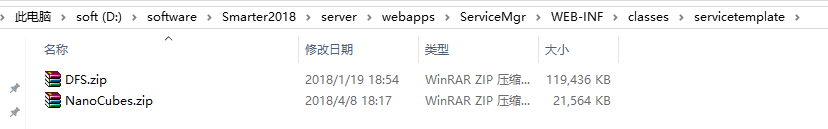
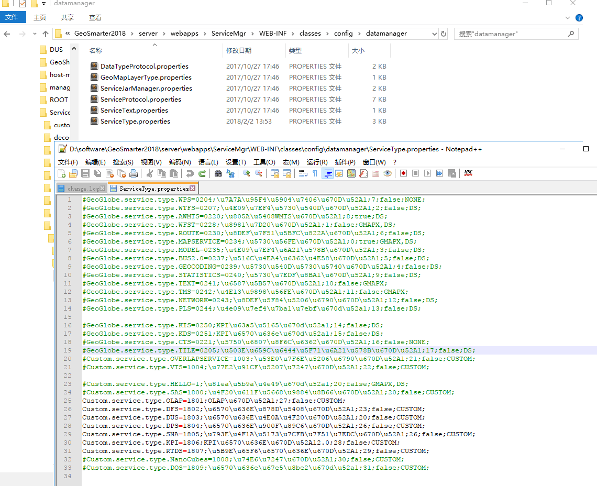

### 问题描述： ###

发布服务时下拉列表缺少可供选择的应服务类型。  
 

### 解决方法： ###
缺少服务模板包，需加上模版包，并改相应配置文件  
\GeoSmarter\server\webapps\ServiceMgr\WEB_INF\classes\servicetemple中添加对应模版文件,如下图新增“DFS.zip”
  
  
 \GeoSmarter\server\webapps\ServiceMgr\WEB_INF\classes\config\datamanager\ServiceType.properties中修改配置，将对应模板的注释去掉  
  