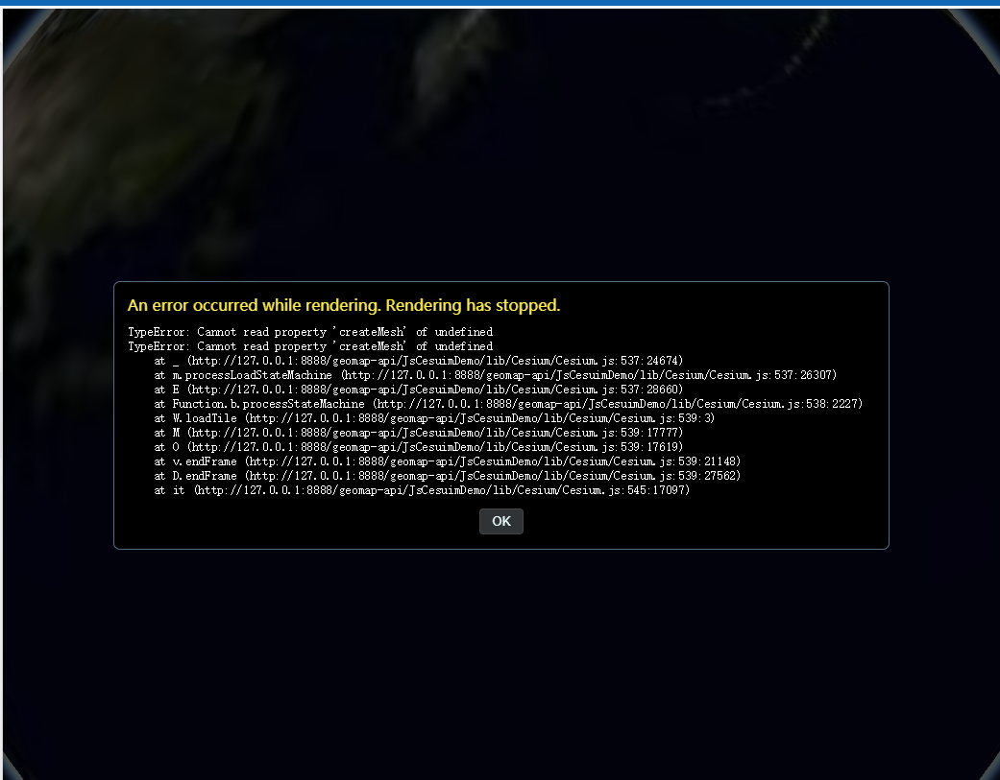

问题：开发中心加载地形时报错如下：

解决方案：有可能是Cesium.GeoTerrainProvider参数不对
Cesium.GeoTerrainProvider默认值Cesium.GeoTerrainProvider.INT。
Cesium.GeoTerrainProvider.INT（天地图地形是int）
Cesium.GeoTerrainProvider.FLOAT（吉奥地形服务可能是float，也可能是int）
使用吉奥地形瓦片请尝试更换此参数
