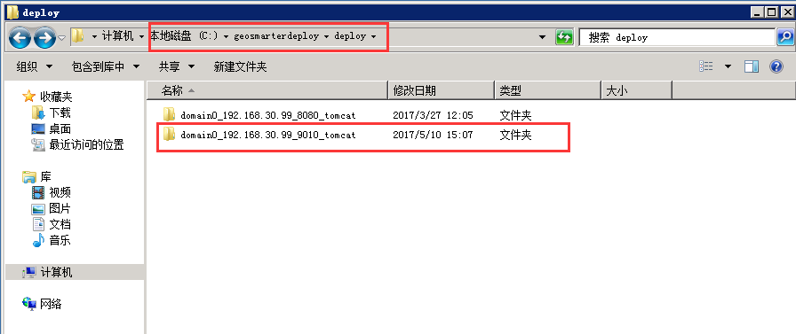
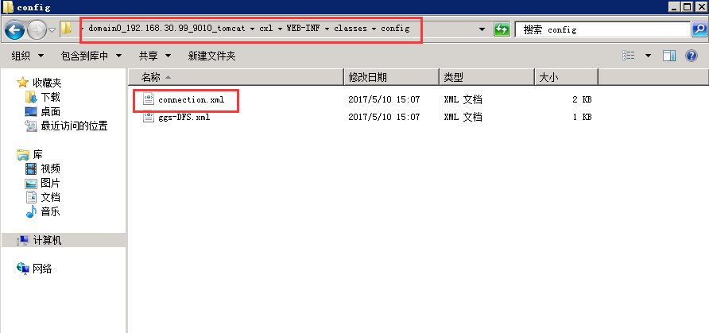
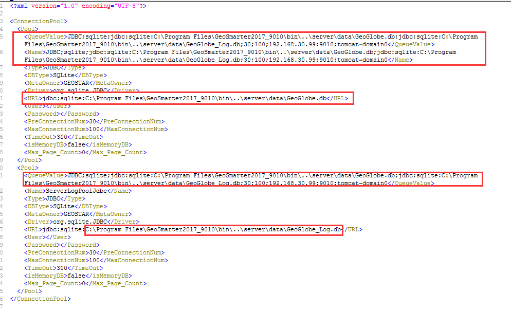
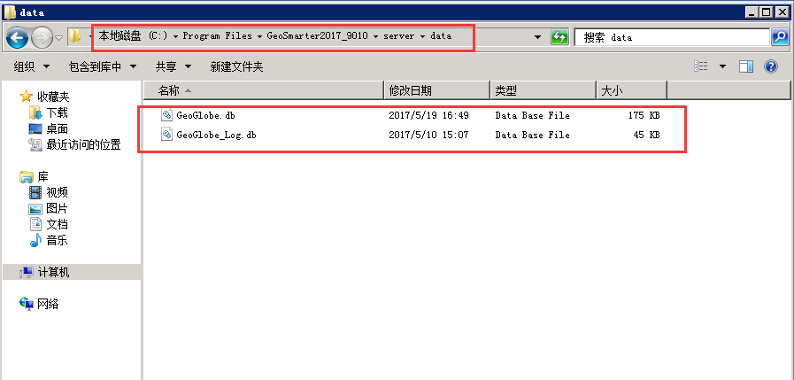
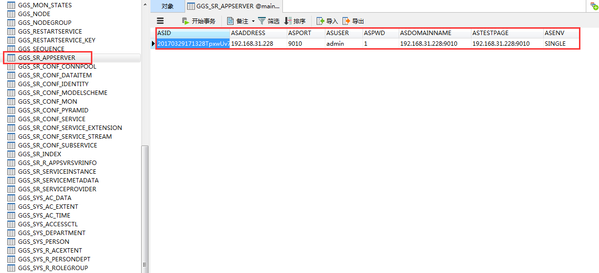
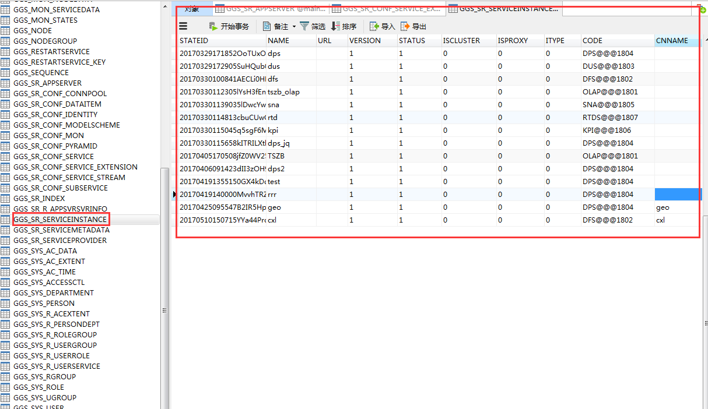
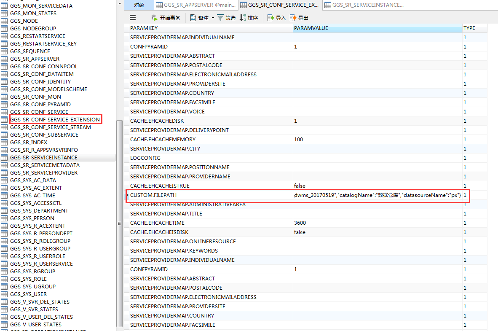
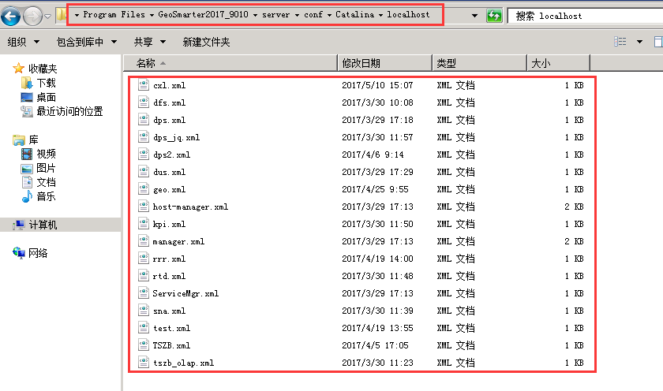
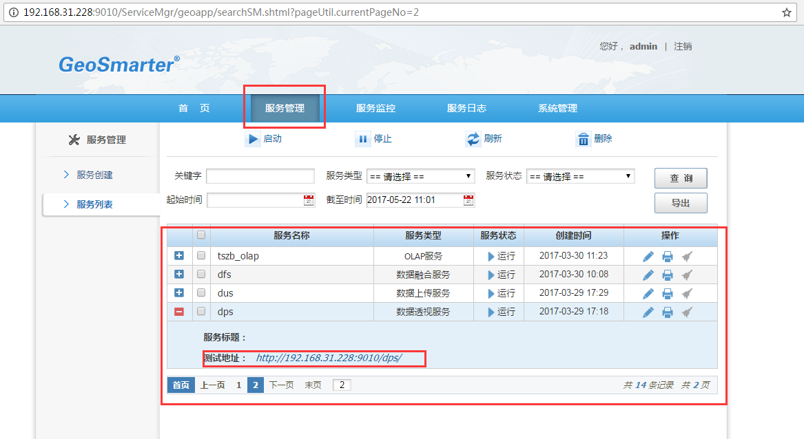
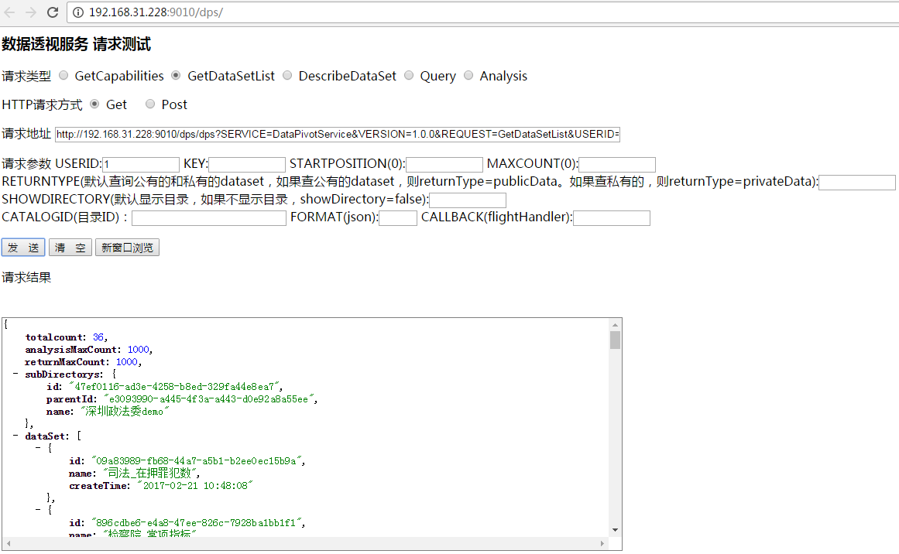

问题描述：

如何将运维系统发布的服务迁移到别分服务器上?

问题解答：

以192.168.30.99服务器中GeoSmarter2017_9010下服务迁移到192.168.31.228服务器GeoSmarter2017为例，介绍服务迁移如下步骤所示：

1.在192.168.30.99服务器上复制

domain0_192.168.30.99_9010_tomcat（路径：C:\geosmarterdeploy\deploy）文件夹到192.168.31.228服务器对应目录下，之后修改服务的配置文件connection.xml
（路径：C:\geosmarterdeploy\deploy\domain0_192.168.30.99_9010_tomcat\cxl\WEB-INF\classes\config）中db文件读取路径和ip地址信息，具体如下图5.1、图5.2和图5.3所示：

图5.1

图5.2

图5.3

2.在192.168.30.99服务器data（路径：C:\Program Files\GeoSmarter2017_9010\server\data）文件夹下GeoGlobe.db和GeoGlobe_Log.db文件到192.168.31.228服务器对应目录下，如图5.4所示：

图5.4

3.打开GeoGlobe.db（路径: C:\Program Files\GeoSmarter2017\server\data\GeoGlobe.db）文件，在表GGS_SR_APPSERVER中修改运维服务端口信息，如图5.5所示

图5.5

4.在表GGS_SR_SERVICEINSTANCE修改服务信息，如图5.6所示

图5.6

5.在表GGS_SR_CONF_SERVICE_EXTENSION中修改数据仓库信息中数据源连接信息和ip地址，如图5.7所示

图5.7

6.在192.168.30.99服务中复制Catalina（路径：C:\Program Files\GeoSmarter2017_9010\server\conf\Catalina\localhost） 文件夹下各个服务xml文件到192.168.31.228中，之后修改xml文件中docbase路径地址，如图5.8、图5.9所示：

图5.8

图5.9

7.重启tomcat服务，进入运维服务系统，测试服务；如图5.10、图5.11所示

图5.10
