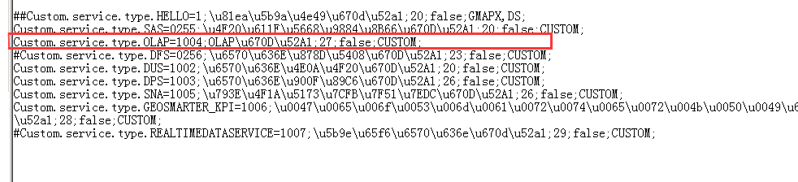
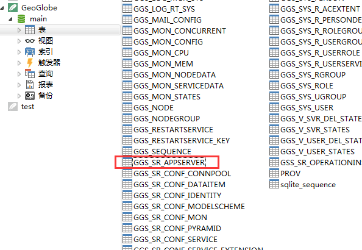

### 问题描述： ###

GeoSmarter ServiceMgr运维系统中，服务类型获取不全或为空。

### 解决方法： ###
服务类型缺失或全空的情况，会由服务文件件是否缺失、服务是否被屏蔽，端口信息是否有误等原因造成，下面以无OLAP服务为例，进行排查和解决服务类型获取不全问题。  
1)先检查有没OLAP文件件，再看服务是否屏蔽  
检查OLAP文件件
\GeoSmarter3.0\server\webapps\ServiceMgr\WEB-INF\classes\servicetemplate 
 
2)看服务是否屏蔽  
\GeoSmarter3.0\server\webapps\ServiceMgr\WEB-INF\classes\config\datamanager\ServiceType.properties   
    
3)检查端口\GeoSmarter2017\server\data\GeoGlobe.db  
   
