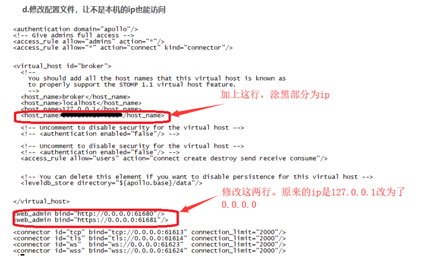
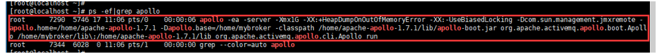

问：数据融合平台需要安装Apache-Apollo具备预警能力，如何安装？

答：
一、	Windows安装部署

https://blog.csdn.net/itas109/article/details/78224606

二、	Linux安装部署

1)	将apache-apollo的解压后文件apache-apollo-1.7.1上传到linux。比如传到/home

2)	为文件授权。

3)	创建broker：进入 /apache-apollo-1.7.1/bin下执行./apollo create mybroker。

比如①cd /home/apache-apollo-1.7.1/bin ②./apollo create mybroker。此步会在/apache-apollo-1.7.1上一层创建一个mybroker目录。比如，这里会自动在/home创建mybroker目录。

4)	修改配置文件
进入/mybroker/etc（这里是/home/ mybroker/etc）,修改apollo.xml文件。

修改完保存配置文件。
5)	运行apollo
进入/mybroker/bin(这里是/home/mybroker/bin),运行nohup ./apollo-broker run

6)	检查是否正常运行。
ps –ef|grep apollo。正常运行的情况如图。

