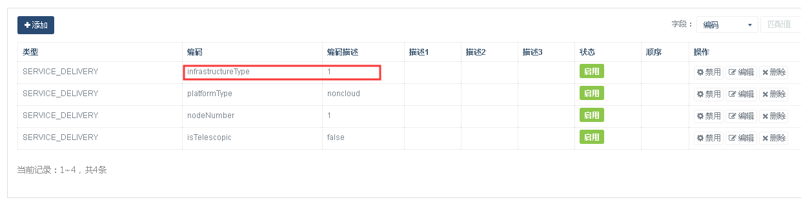

问题描述：

云化部署大数据中心，包含GeoStack和GeoSmarter，在GeoStack中可以正常发布地图服务，但是在GeoSmarter中无法发布地图服务。

问题解答：

1.	登录GeoStack页面，进入“系统管理”->“字典管理”->“服务投递配置”。
2.	检查infrastructureType的值：

3.	如果infrastructureType的值是否为1，1表示投递的服务类型为docker容器，2表示投递的服务类型为lxc容器，此时需要将infrastructureType的值改为1。
4.	再次在大数据中心服务中心中发布地图服务成功
