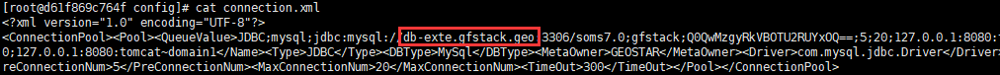

【问题描述】

在GeoStack中发布地图服务成功，在地图服务的REST请求测试页面中，发送请求后返回500错误。

【解决方法】
> 1.	登录GeoGlobe Docker宿主机，连进mapservice docker；
> 2.	进入/srv/tomcat8/webapps/MT002/WEB-INF/classes/config/
> 3.	打开connection.xml文件，并检查db-exte.gfstack.geo是否可以ping通

> 4.	若无法ping通，则在docker宿主机的/etc/sysconfig/network-scripts/ifcfg-xxx中添加DNS域名服务器的地址；
> 5.	确保在mapservice的docker内能ping通db-exte.gfstack.geo，再次发布地图服务，可以在REST请求测试页面中返回正确的结果。

