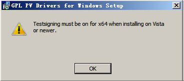

问题描述：

Windows虚拟机在安装Tools过程中，弹出如下所示窗口

可能原因：
当虚拟机的操作系统为64位Windows Vista及以上版本时，没有在“Test Mode”下安装
Tools。

解决方法：

1 在虚拟机桌面，选择“开始 > 运行”。

2 在弹出的窗口中输入cmd。

3 执行以下命令，切换至“Test Mode”模式。

bcdedit -set testsigning on

4 重启虚拟机。

5 重新安装Tools。

