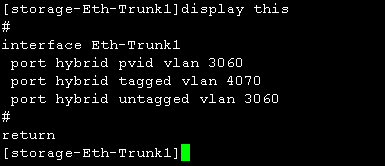

问题描述：

多张网卡的服务器配置了网卡绑定后，网卡连接的交换机的端口也需要做端口绑定，以实现负载均衡等能力。本例假设服务器有两个网口，分别连接交换机的8口和16口。

1.	远程登录到交换机的管理（根据交换机配置，可能使用SSH、telnet或者串口等方式，请根据实际配置情况选择）。

2.	输入system-view命令进入system视图。
3.	执行命令interface Eth-Trunk 1创建一个Eth-Trunk。
4.	执行interface Eth-Trunk 1进入Eth-Trunk 1视图。
5.	配置该Eth-Trunk接口默认vlan为3060，并允许4070通过： 

   
> port  hybrid  pvid  vlan  3060
> 
> port  hybrid  tagged  vlan  4070
> 
> port  hybrid  untagged  vlan  3060
> 

6.	执行display this查看Eth-Trunk 1的配置：

7.	将端口6和端口18加入到Trunk 1中：

> interface  XGigabitEthernet0/0/6
> 
> eth-trunk 1

> interface  XGigabitEthernet0/0/18

> eth-trunk 1

注意：不同主机之间即使端口属性一样，也应该配置不同的Trunk，例如如果配置下一台主机的聚合策略，则需要创建一个新的eth-trunk 2。