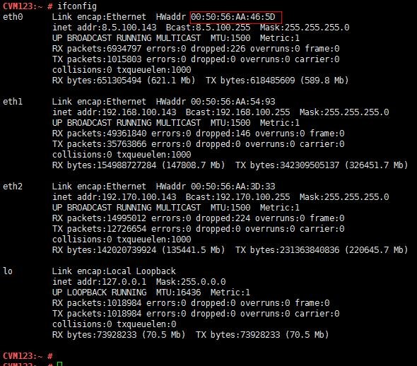
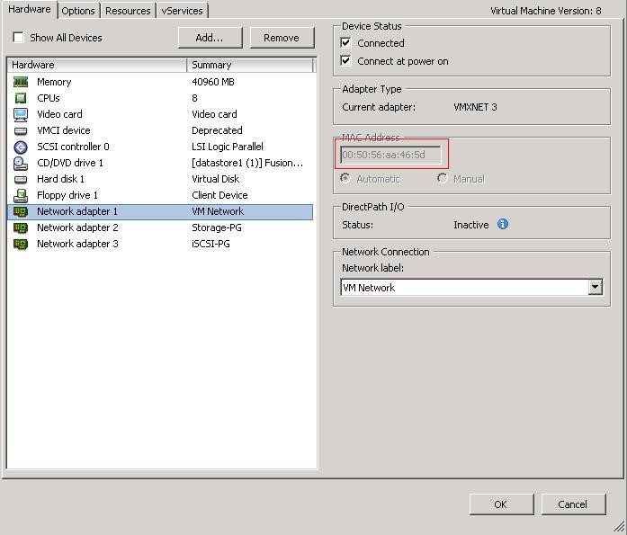

问题描述：

主机在加入虚拟化软件之后，在配置虚拟化软件的端口组时需要将虚拟化软件识别到的网口跟实际主机端口一一对应起来。
对系统的影响：无

问题解答：

1.	通过vSphere Client登录到vCenter（见3.7 使用vClient登录vCenter或者ESXi节）
2.	登录CVM虚拟机的控制台窗口。
3.	执行ifconfig –a命令查看系统3个网卡的设备名和mac地址，（以设备名为eth0、eth1、eth2为例）

4.	在vCenter中查看CVM虚拟机3个网卡的mac地址，并记录操作系统中网卡设备名与端口组的对应关系。（如图中标识eth0属于“VM Network”的端口组，即管理平面端口组，应该配置管理IP地址）

