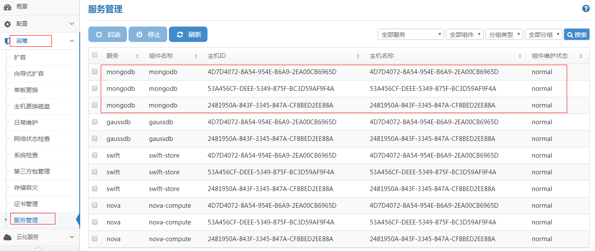
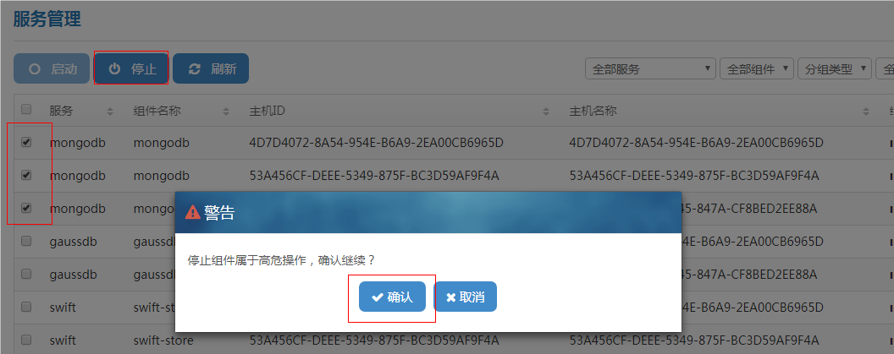
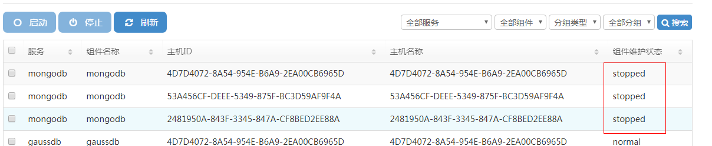

问题描述：

关闭MongoDB服务

解决方法：

MongoDB服务异常关闭时可能会导致内存中数据无法落入磁盘，导致主备切换、数据回滚、journal（即redo log）日志损坏、数据文件不一致状态等情况。因此，在需要对主机进行下电操作时，需要先执行操作正常关闭MongoDB服务。

步骤1 登录FusionSphere OpenStack的安装部署界面。

步骤2 在FusionSphere OpenStack的安装部署界面，选择“运维 > 服务管理”，进入“服务管理”页面。

步骤3 选中需要关闭的MongoDB所在节点，单击“停止”，在弹窗中单击“确认”。

步骤4 在“组件维护状态”中，查看步骤3中关闭的MongoDB所在节点的状态为“stopped”，则成功关闭MongoDB服务。

