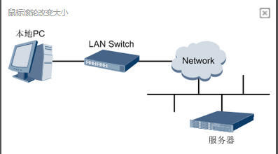
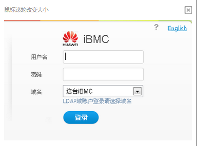

问题描述：

如何登录华为2288服务器iBMC Web界面

解决方法：

1.使用网线（交叉网线或双绞线）连接本地PC和服务器的iBMC管理网口。连接组网图如下图所示。

2.在本地PC中打开IE浏览器。

3.在地址栏中，输入iBMC系统的地址，地址格式为“https://服务器iBMC管理网口的IP地址”，例如“https://192.168.2.100”。
按“Enter”键，IE浏览器中显示iBMC的登录界面，如下图所示。

4在iBMC登录界面中，输入登录iBMC系统的用户名和密码。

5.在“域名”下拉列表框中，选择“这台iBMC”。

6.单击“登录”。

进入“信息概况”界面。界面右上角将显示登录的用户名。
