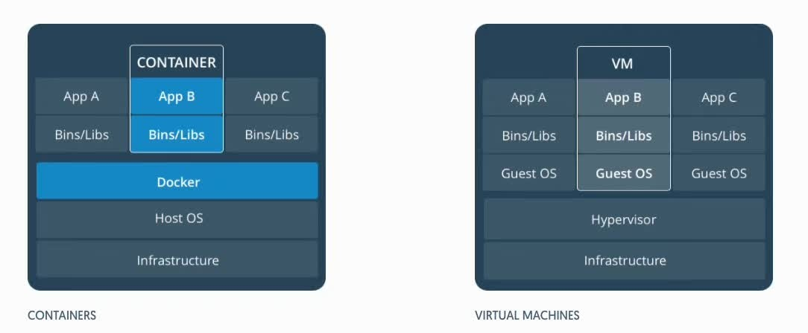

标题：容器与虚拟机有什么区别？

解答：

虚拟机 (VM) 是一个物理硬件层抽象，用于将一台服务器变成多台服务器。 管理程序允许多个 VM 在一台机器上运行。每个VM都包含一整套操作系统、一个或多个应用、必要的二进制文件和库资源，因此 占用大量空间 。而且 VM 启动也十分缓慢 。
容器是一个应用层抽象，用于将代码和依赖资源打包在一起。多个容器可以在同一台机器上运行，共享操作系统内核，但各自作为独立的进程在用户空间中运行 。与虚拟机相比， 容器占用的空间较少（容器镜像大小通常只有几十兆），瞬间就能完成启动 。
