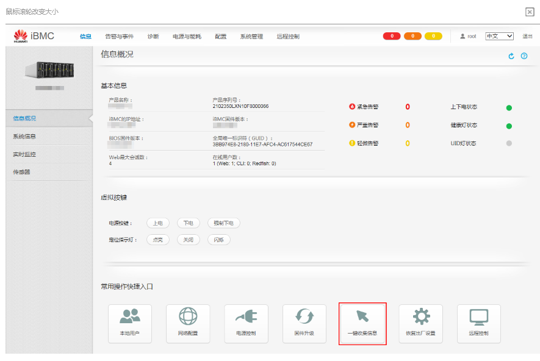

问题描述：

华为2288服务器如何通过iBMC一键收集信息

解决方法：

 1.登录iBMC Web界面，详细操作请参见登录iBMC Web界面。

 2.依次选择“信息 > 信息概况 > 常用操作快捷入口 > 一键收集信息”，如下图所示。

 3.单击“一键收集信息”。
界面提示正在收集信息，收集完成后显示收集文件“dump_info.tar.gz”。

4.单击收集文件，根据界面提示将其下载至本地PC机。

