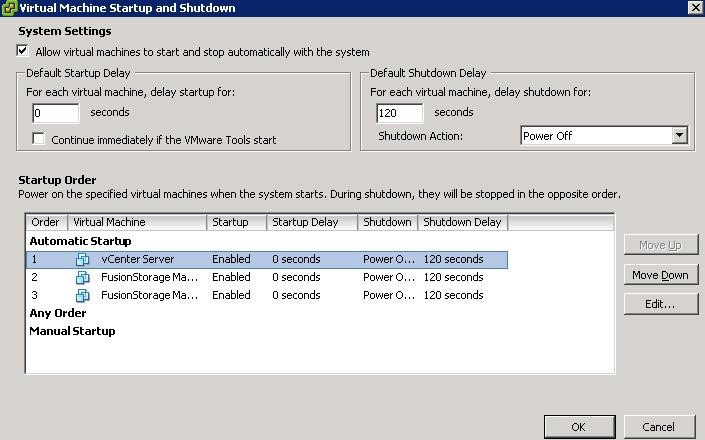

问题描述：

虚拟化场景下有可能出现主机断电关机或是主机故障的问题导致虚拟机随主机一同停机的情况，针对这种突发场景在VMware里可以设置虚拟机随主机同时启动。

1.	通过vClient登录到vCenter（见3.7 使用vClient登录vCenter或者ESXi节）。
2.	选择要随主机启动的虚拟机所在的主机（单击“主机”，并查看“虚拟机”页签，可以看到当前主机上有哪些虚拟机）。
3.	单击“配置”标签，在“软件”框中选择“虚拟机启动/关机”项。
4.	在“虚拟机启动和关机”窗口中，单击“属性”，弹出“虚拟机启动和关机”面板。
5.	勾选“允许虚拟机与系统一起自动启动和停止”，在“默认启动延迟”窗口中配置“对于每个虚拟机，启动延迟”为0秒，在“启动顺序”窗口中，选择需要随主机启动的虚拟机，并单击“上移”按钮，直到该虚拟机移动到“自动启动”项中，例如：

单击“确定”

