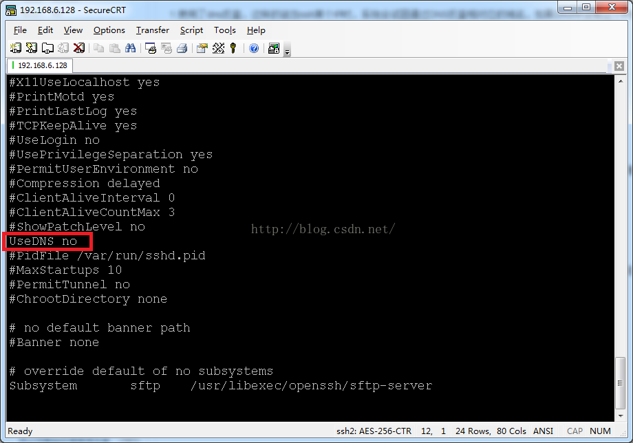

问题：

我的服务器SSH登陆总是很慢，怎么优化？
解决方案：
可能是使用了dns反查，这样的话当ssh某个IP时，系统会试图通过DNS反查相对应的域名，如果DNS中没有这个IP的域名解析，则会等到DNS查询超时才会进行下一步，消耗很长时间。

修改方式:
使用root权限修改ssh的配置文件，vim /etc/ssh/sshd_config
增加一行记录：UseDNS no

默认情况下会有一行被注释掉的记录#UseDNS yes，虽然这条记录被注释掉了，但ssh缺省情况下UseDNS的值是yes，所以要显式的指定该值为no。
重新启动ssh服务
